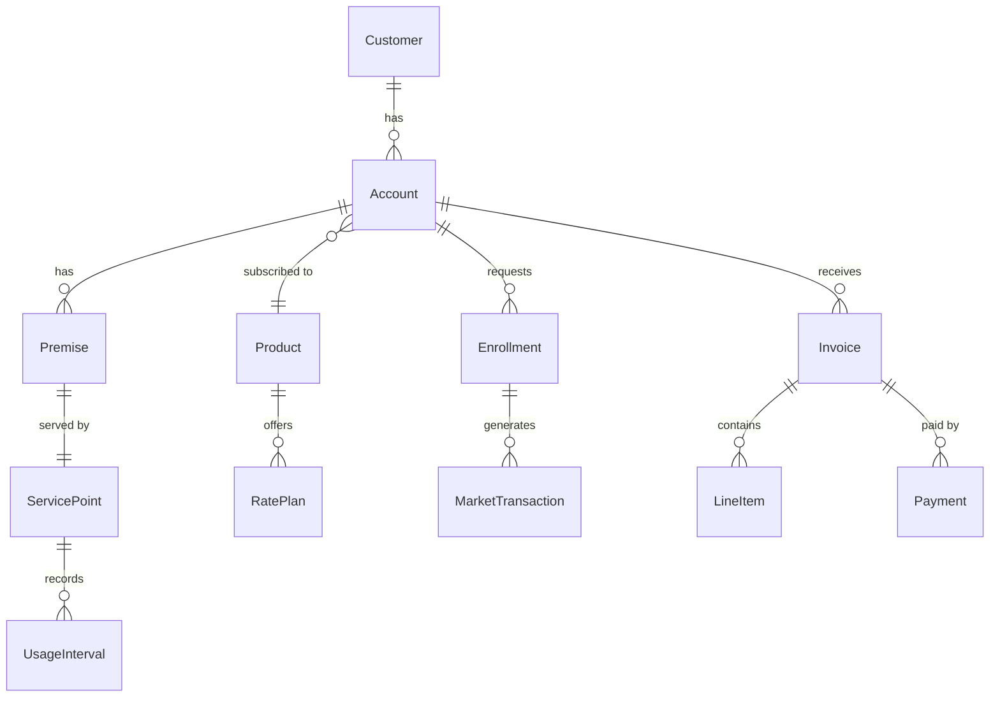

# Domain Model

The Exarep domain model reflects the core concepts of a retail electricity provider operating in the ERCOT market.

## Domain Overview

## Core Entities

### Customer

A customer is the individual or organization that holds one or more accounts with the retail electricity provider.

| Field        | Type      | Description                                     |
| ------------ | --------- | ----------------------------------------------- |
| customerId   | BIGINT    | Unique identifier                               |
| firstName    | TEXT      | Customer first name                             |
| lastName     | TEXT      | Customer last name                              |
| email        | TEXT      | Contact email address                           |
| phone        | TEXT      | Contact phone number                            |
| customerType | TEXT      | RESIDENTIAL or COMMERCIAL                       |
| createdAt    | TIMESTAMP | Record creation timestamp                       |
| updatedAt    | TIMESTAMP | Record last update timestamp                    |

### Account

An account represents a billing relationship between a customer and a premise.

| Field       | Type      | Description                                      |
| ----------- | --------- | ------------------------------------------------ |
| accountId   | BIGINT    | Unique identifier                                |
| customerId  | BIGINT    | Reference to the owning customer                 |
| productId   | BIGINT    | Reference to the subscribed product              |
| status      | TEXT      | ACTIVE, INACTIVE, PENDING, CLOSED                |
| createdAt   | TIMESTAMP | Record creation timestamp                        |
| updatedAt   | TIMESTAMP | Record last update timestamp                     |

### Premise

A premise is the physical location where electricity is consumed.

| Field          | Type      | Description                                   |
| -------------- | --------- | --------------------------------------------- |
| premiseId      | BIGINT    | Unique identifier                             |
| accountId      | BIGINT    | Reference to the associated account           |
| servicePointId | BIGINT    | Reference to the ERCOT service point          |
| address        | TEXT      | Street address                                |
| city           | TEXT      | City                                          |
| state          | TEXT      | State (TX)                                    |
| zip            | TEXT      | ZIP code                                      |
| createdAt      | TIMESTAMP | Record creation timestamp                     |
| updatedAt      | TIMESTAMP | Record last update timestamp                  |

### ServicePoint

A service point represents the ERCOT-assigned metering point (ESI ID) for a premise.

| Field          | Type      | Description                                   |
| -------------- | --------- | --------------------------------------------- |
| servicePointId | BIGINT    | Unique identifier                             |
| esiId          | TEXT      | ERCOT ESI ID (unique meter identifier)        |
| tdsp           | TEXT      | Transmission/Distribution Service Provider    |
| meterType      | TEXT      | Meter type classification                     |
| createdAt      | TIMESTAMP | Record creation timestamp                     |
| updatedAt      | TIMESTAMP | Record last update timestamp                  |

### Product

A product represents an electricity plan offered to customers.

| Field       | Type      | Description                                      |
| ----------- | --------- | ------------------------------------------------ |
| productId   | BIGINT    | Unique identifier                                |
| name        | TEXT      | Product name                                     |
| description | TEXT      | Product description                              |
| termMonths  | INT       | Contract term in months                          |
| status      | TEXT      | ACTIVE, INACTIVE                                 |
| createdAt   | TIMESTAMP | Record creation timestamp                        |
| updatedAt   | TIMESTAMP | Record last update timestamp                     |

### Enrollment

An enrollment represents a customer's request to begin or switch electricity service.

| Field          | Type      | Description                                   |
| -------------- | --------- | --------------------------------------------- |
| enrollmentId   | BIGINT    | Unique identifier                             |
| accountId      | BIGINT    | Reference to the account                      |
| servicePointId | BIGINT    | Reference to the service point                |
| type           | TEXT      | MOVE_IN, SWITCH, MOVE_OUT                     |
| status         | TEXT      | PENDING, SUBMITTED, COMPLETED, REJECTED       |
| requestedDate  | DATE      | Requested effective date                      |
| effectiveDate  | DATE      | Actual effective date                         |
| createdAt      | TIMESTAMP | Record creation timestamp                     |
| updatedAt      | TIMESTAMP | Record last update timestamp                  |

### Invoice

An invoice represents a billing statement for an account.

| Field      | Type      | Description                                       |
| ---------- | --------- | ------------------------------------------------- |
| invoiceId  | BIGINT    | Unique identifier                                 |
| accountId  | BIGINT    | Reference to the billed account                   |
| periodStart| DATE      | Billing period start date                         |
| periodEnd  | DATE      | Billing period end date                           |
| totalAmount| DECIMAL   | Total invoice amount                              |
| status     | TEXT      | DRAFT, ISSUED, PAID, OVERDUE                      |
| createdAt  | TIMESTAMP | Record creation timestamp                         |
| updatedAt  | TIMESTAMP | Record last update timestamp                      |

## ERCOT Context

!!! info "About ERCOT"
    The **Electric Reliability Council of Texas (ERCOT)** manages the flow of electric power to approximately 27 million Texas customers. In the deregulated Texas electricity market, retail electricity providers (REPs) compete to sell electricity to consumers while ERCOT manages the grid and facilitates market transactions.

Key ERCOT concepts modeled in Exarep:

**ESI ID**
:   The Electric Service Identifier is a unique 17- or 22-digit number assigned to each metering point in the ERCOT market. It uniquely identifies where electricity is delivered.

**TDSP**
:   The Transmission and Distribution Service Provider (also known as a TDU — Transmission and Distribution Utility) owns and maintains the physical wires and infrastructure. Examples include Oncor, CenterPoint, and AEP Texas.

**Market Transactions**
:   Standardized electronic transactions between market participants (REPs, TDSPs, ERCOT) for enrollments, switches, drops, and usage data exchange.
