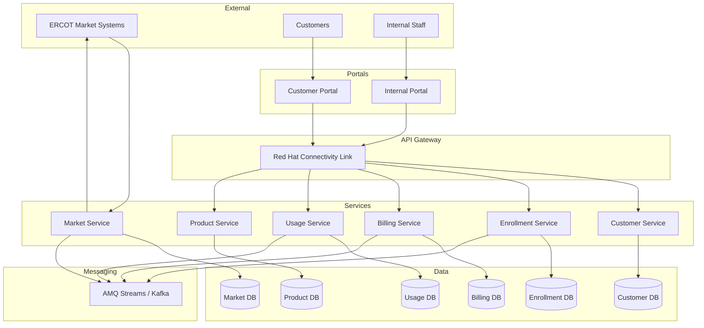

# Architecture Overview

Exarep follows a **microservices architecture** deployed on Red Hat OpenShift, with services communicating through REST APIs, gRPC, and event-driven messaging via Apache Kafka.

## High-Level Architecture

## Design Principles

**Service Autonomy**
:   Each service owns its data and business logic. Services communicate through well-defined APIs and events, never sharing databases.

**API-First**
:   All service interfaces are defined using OpenAPI specifications for REST and Protocol Buffers for gRPC before implementation begins.

**Event-Driven**
:   Domain events are published to Kafka topics, enabling loose coupling between services and supporting eventual consistency.

**GitOps-Driven**
:   All cluster configuration and application deployments are managed declaratively through Git repositories and reconciled by Argo CD.

**Infrastructure as Code**
:   AWS infrastructure is provisioned with Terraform and configured with Ansible, ensuring repeatable and auditable environments.

## Communication Patterns

| Pattern              | Use Case                                                  | Technology          |
| -------------------- | --------------------------------------------------------- | ------------------- |
| Synchronous REST     | Portal-to-service calls, CRUD operations                  | Quarkus RESTEasy    |
| Synchronous gRPC     | High-performance inter-service calls                      | Quarkus gRPC        |
| Asynchronous Events  | Domain events, cross-service coordination                 | AMQ Streams (Kafka) |
| Batch Integration    | ERCOT market file processing                              | Scheduled jobs      |
