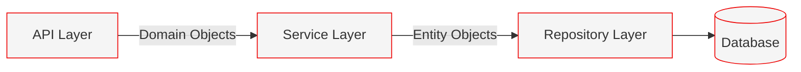

# Microservices

Each Exarep microservice is a Quarkus application following a consistent three-tier architecture: API, Service, and Repository layers.

## Service Catalog

### api-customer

The customer service manages customer profiles, accounts, and premises. It serves as the system of record for all customer-related data.

- **Bounded Context:** Customer management
- **Key Entities:** Customer, Account, Premise, ServicePoint
- **Events Produced:** `customer.created`, `account.created`, `premise.created`

### api-enrollment

The enrollment service handles the lifecycle of enrollment and switch transactions between the customer and the ERCOT market.

- **Bounded Context:** Enrollment and switching
- **Key Entities:** Enrollment, SwitchTransaction
- **Events Produced:** `enrollment.submitted`, `enrollment.completed`, `switch.initiated`, `switch.completed`
- **Events Consumed:** `customer.created`, `market.transaction.completed`

### api-billing

The billing service generates invoices based on usage data, rate plans, and account information.

- **Bounded Context:** Billing and invoicing
- **Key Entities:** Invoice, LineItem, Payment, BillingCycle
- **Events Produced:** `invoice.generated`, `payment.received`
- **Events Consumed:** `usage.interval.received`, `account.created`

### api-usage

The usage service ingests and stores meter usage data received from ERCOT through interval data files.

- **Bounded Context:** Usage and metering
- **Key Entities:** UsageInterval, MeterRead
- **Events Produced:** `usage.interval.received`
- **Events Consumed:** `market.usage.received`

### api-market

The market service manages interactions with ERCOT market systems, including transaction processing and market file handling.

- **Bounded Context:** Market integration
- **Key Entities:** MarketTransaction, MarketParticipant
- **Events Produced:** `market.transaction.completed`, `market.usage.received`

### api-product

The product service manages electricity rate plans, product offerings, and pricing structures.

- **Bounded Context:** Product catalog
- **Key Entities:** Product, RatePlan, PricingTier
- **Events Produced:** `product.created`, `product.updated`

## Application Structure

Each service follows a consistent package and layer structure:

```
com.exarep.{service_name}/
├── api/
│   ├── {Entity}Resource.java
│   ├── {Entity}Request.java
│   └── {Entity}Response.java
├── service/
│   ├── {Entity}Service.java
│   └── {Entity}.java              # Domain record
└── repository/
    ├── {Entity}Repository.java
    └── {Entity}Entity.java
```

### Layer Responsibilities



**API Layer**
:   Handles HTTP requests and responses. Converts between request/response records and domain objects. Defines OpenAPI annotations and role-based access control.

**Service Layer**
:   Contains business logic. Consumes and produces domain records only. Interacts exclusively with the repository layer.

**Repository Layer**
:   Manages data persistence using Panache. Works with JPA entity classes. Handles database queries and transactions.

## Database Per Service

Each service owns its PostgreSQL database. Schema management is handled by Flyway.

| Service          | Database            | Schema Prefix |
| ---------------- | ------------------- | ------------- |
| api-customer     | exarep_customer     | customer      |
| api-enrollment   | exarep_enrollment   | enrollment    |
| api-billing      | exarep_billing      | billing       |
| api-usage        | exarep_usage        | usage         |
| api-market       | exarep_market       | market        |
| api-product      | exarep_product      | product       |
