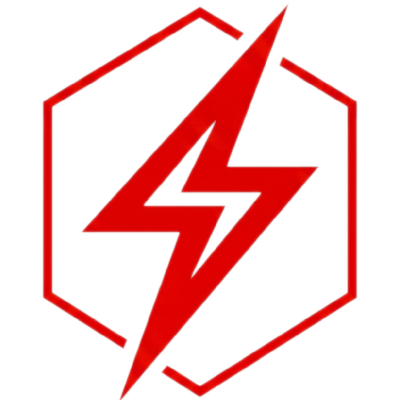

# { width="60" } Exarep

Exarep is a **reference architecture** for building and operating microservices on **Red Hat OpenShift**, modeled as a retail electricity provider (REP) operating in the **ERCOT** market in Texas.

The project demonstrates end-to-end patterns for developing, deploying, and managing cloud-native applications using the Red Hat ecosystem.

## Purpose

The retail electricity market in Texas is a deregulated, competitive landscape managed by the Electric Reliability Council of Texas (ERCOT). A retail electricity provider must integrate with ERCOT market systems, manage customer accounts, handle enrollments and switches, process billing, and ingest meter usage data — making it an ideal domain for showcasing enterprise microservice patterns.

Exarep uses this domain to provide a complete, working example of:

- **Microservice development** with Quarkus and Java
- **Container orchestration** on OpenShift
- **GitOps-driven deployments** with OpenShift GitOps (Argo CD)
- **Event-driven architecture** with Apache Kafka (AMQ Streams)
- **API-first design** with OpenAPI and gRPC
- **Identity and access management** with OIDC (Keycloak)
- **Infrastructure automation** with Ansible

## Repositories

| Repository                                                                  | Description                                        |
| --------------------------------------------------------------------------- | -------------------------------------------------- |
| [exarep.github.io](https://github.com/exarep/exarep.github.io)             | Documentation site                                 |
| [api-customer](https://github.com/exarep/api-customer)                     | Customer and account management service            |
| [api-enrollment](https://github.com/exarep/api-enrollment)                 | Enrollment and switch transaction service           |
| [api-billing](https://github.com/exarep/api-billing)                       | Billing and invoice generation service             |
| [api-usage](https://github.com/exarep/api-usage)                           | Meter usage data ingestion and retrieval service   |
| [api-market](https://github.com/exarep/api-market)                         | ERCOT market transaction interface service         |
| [api-product](https://github.com/exarep/api-product)                       | Product and rate plan management service           |
| [portal-customer](https://github.com/exarep/portal-customer)               | Customer self-service portal                       |
| [portal-internal](https://github.com/exarep/portal-internal)               | Internal operations portal                         |
| [gitops-platform](https://github.com/exarep/gitops-platform)               | OpenShift platform GitOps (cluster configuration)  |
| [gitops-apps](https://github.com/exarep/gitops-apps)                       | Application deployment GitOps                      |
| [iac-ansible](https://github.com/exarep/iac-ansible)                       | Ansible automation for services environment        |
| [iac-aws](https://github.com/exarep/iac-aws)                               | AWS infrastructure automation (Terraform)          |
| [library-common](https://github.com/exarep/library-common)                 | Shared Java libraries                              |
| [integration-ercot](https://github.com/exarep/integration-ercot)           | ERCOT market file integration jobs                 |

## Technology Stack

| Layer          | Technology                                    |
| -------------- | --------------------------------------------- |
| Language       | Java (latest LTS)                             |
| Framework      | Quarkus                                       |
| Frontend       | Angular (latest LTS) with ng-bootstrap        |
| Database       | PostgreSQL                                    |
| Messaging      | Apache Kafka (AMQ Streams)                    |
| Container      | Podman                                        |
| Orchestration  | Red Hat OpenShift                             |
| GitOps         | OpenShift GitOps (Argo CD)                    |
| CI/CD          | OpenShift Pipelines (Tekton)                  |
| Identity       | Keycloak (OIDC)                               |
| Service Mesh   | Red Hat Service Mesh                          |
| Secrets        | External Secrets Operator                     |
| Automation     | Ansible                                       |
| Cloud          | AWS (us-east-2)                               |
