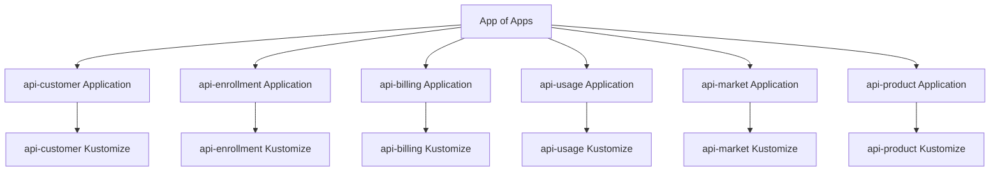

# GitOps

All cluster configuration and application deployments in Exarep are managed through **OpenShift GitOps (Argo CD)** using a declarative, Git-driven approach.

## Repository Strategy

Exarep uses two GitOps repositories to separate concerns:

| Repository         | Scope                                   | Description                                        |
| ------------------ | --------------------------------------- | -------------------------------------------------- |
| `gitops-platform`  | Cluster configuration                   | Takes a fresh cluster to production-ready state     |
| `gitops-apps`      | Application workloads                   | Deploys Exarep services after platform is ready     |

## Platform GitOps Structure

The `gitops-platform` repository manages operator installations, namespace creation, and platform service configuration.

```
gitops-platform/
├── clusters/
│   ├── hub/
│   │   ├── preproduction/
│   │   │   ├── applications/
│   │   │   │   ├── external-secrets.yaml
│   │   │   │   ├── amq-streams.yaml
│   │   │   │   ├── service-mesh.yaml
│   │   │   │   └── kustomization.yaml
│   │   │   ├── external-secrets/
│   │   │   │   └── kustomization.yaml
│   │   │   ├── amq-streams/
│   │   │   │   └── kustomization.yaml
│   │   │   └── app-of-apps.yaml
│   │   └── production/
│   └── spoke/
│       ├── development/
│       ├── test/
│       └── production/
├── resources/
│   ├── external-secrets-operator/
│   │   ├── kustomization.yaml
│   │   ├── namespace.yaml
│   │   ├── operator-group.yaml
│   │   └── subscription.yaml
│   └── amq-streams/
│       ├── kustomization.yaml
│       ├── namespace.yaml
│       ├── operator-group.yaml
│       └── subscription.yaml
├── bootstrap.yaml
└── README.md
```

## Sync Waves

All manifests use sync waves to ensure correct ordering of resource creation:

| Sync Wave | Resource Type                          |
| --------- | -------------------------------------- |
| 0         | Namespace                              |
| 1         | OperatorGroup                          |
| 2         | Subscription (Operator install)        |
| 3         | Custom resources (instances)           |
| 4+        | Dependent custom resources             |

!!! example "Kustomization ordering"
    Resources in `kustomization.yaml` are listed in sync wave order with comments:

    ```yaml
    resources:
      - namespace.yaml          # sync-wave-0
      - operator-group.yaml     # sync-wave-1
      - subscription.yaml       # sync-wave-2
      - kafka-cluster.yaml      # sync-wave-3
    ```

## Application GitOps Structure

The `gitops-apps` repository deploys Exarep microservices after the platform is configured.

```
gitops-apps/
├── clusters/
│   ├── development/
│   │   ├── applications/
│   │   │   ├── api-customer.yaml
│   │   │   ├── api-enrollment.yaml
│   │   │   ├── api-billing.yaml
│   │   │   └── kustomization.yaml
│   │   ├── api-customer/
│   │   │   └── kustomization.yaml
│   │   └── app-of-apps.yaml
│   ├── test/
│   └── production/
├── resources/
│   ├── api-customer/
│   │   ├── kustomization.yaml
│   │   ├── deployment.yaml
│   │   ├── service.yaml
│   │   └── route.yaml
│   └── api-enrollment/
│       ├── kustomization.yaml
│       ├── deployment.yaml
│       ├── service.yaml
│       └── route.yaml
└── README.md
```

## App of Apps Pattern

Each cluster environment has an `app-of-apps.yaml` that serves as the root Argo CD Application. It points to the `applications/` directory, which contains individual Application manifests for each component.


