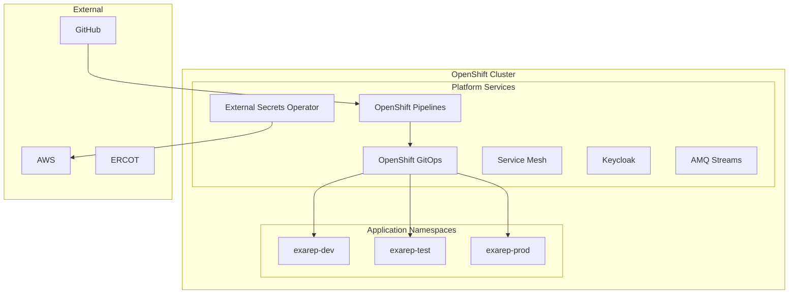

# Platform Overview

The Exarep platform is built on **Red Hat OpenShift** with a complete set of supporting services for running production microservices.

## Platform Components

## Cluster Topology

Exarep targets a multi-cluster OpenShift topology managed by Red Hat Advanced Cluster Management (ACM).

| Cluster        | Type   | Role                                              | Environment |
| -------------- | ------ | ------------------------------------------------- | ----------- |
| Preprod Hub    | Hub    | ACM, ACS, GitOps, Pipelines, DevSpaces, Dev Hub   | preprod     |
| Prod Hub       | Hub    | ACM, ACS, GitOps                                  | prod        |
| Development    | Spoke  | Development workloads                              | dev         |
| Test           | Spoke  | Test and integration workloads                     | test        |
| Production     | Spoke  | Production workloads                               | prod        |

## Namespace Strategy

Each environment uses a dedicated namespace with consistent naming:

| Namespace              | Purpose                                    |
| ---------------------- | ------------------------------------------ |
| `exarep-dev`           | Development workloads                      |
| `exarep-test`          | Test and integration workloads             |
| `exarep-prod`          | Production workloads                       |
| `exarep-kafka`         | AMQ Streams (Kafka) cluster                |
| `exarep-keycloak`      | Keycloak identity provider                 |
| `exarep-observability` | Monitoring and logging                     |

All namespaces include the `openshift.io/cluster-monitoring: "true"` label for cluster monitoring integration.

## Platform Services

| Service                     | Purpose                                       | Operator / Product                |
| --------------------------- | --------------------------------------------- | --------------------------------- |
| OpenShift GitOps            | Declarative cluster and app configuration      | Red Hat OpenShift GitOps          |
| OpenShift Pipelines         | CI/CD pipelines                                | Red Hat OpenShift Pipelines       |
| Red Hat Service Mesh        | mTLS, traffic management, observability        | Red Hat Service Mesh              |
| AMQ Streams                 | Event streaming                                | Red Hat AMQ Streams               |
| Red Hat Developer Hub       | Developer portal and service catalog           | Red Hat Developer Hub             |
| Red Hat Connectivity Link   | API management and gateway                     | Red Hat Connectivity Link         |
| External Secrets Operator   | Secrets management from external stores        | External Secrets Operator         |
| Red Hat ACS                 | Container and Kubernetes security              | Red Hat Advanced Cluster Security |
| Red Hat ACM                 | Multi-cluster management                       | Red Hat Advanced Cluster Mgmt     |
