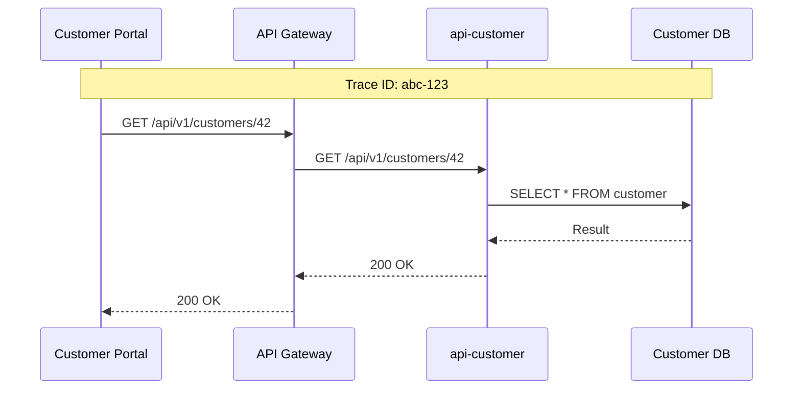

# Observability

Exarep uses the built-in OpenShift observability stack along with Red Hat Service Mesh to provide comprehensive monitoring, logging, and tracing across all microservices.

## Observability Stack

| Capability        | Technology                                   |
| ----------------- | -------------------------------------------- |
| Metrics           | OpenShift Monitoring (Prometheus)            |
| Logging           | OpenShift Logging (Loki)                     |
| Tracing           | Red Hat Service Mesh (Jaeger / Tempo)        |
| Dashboards        | OpenShift Console / Grafana                  |
| Alerting          | Prometheus Alertmanager                      |

## Metrics

Each Quarkus service exposes Prometheus-compatible metrics via the Micrometer extension at the `/q/metrics` endpoint.

Key application metrics include:

- HTTP request rate, latency, and error rate
- Database connection pool utilization
- Kafka consumer lag and throughput
- JVM memory and garbage collection

### Service Monitors

OpenShift `ServiceMonitor` resources are deployed via GitOps to scrape metrics from each service:

```yaml
apiVersion: monitoring.coreos.com/v1
kind: ServiceMonitor
metadata:
  name: api-customer
  namespace: exarep-prod
spec:
  selector:
    matchLabels:
      app: api-customer
  endpoints:
    - port: http
      path: /q/metrics
      interval: 30s
```

## Logging

Services use structured JSON logging via Quarkus, which is collected by the OpenShift Logging stack.

Log format includes:

- Timestamp
- Log level
- Logger name
- Correlation ID (trace ID from Service Mesh)
- Message
- Exception details (when applicable)

## Distributed Tracing

Red Hat Service Mesh provides automatic distributed tracing across services. Trace context is propagated through HTTP headers, giving end-to-end visibility into request flows.



## Health Checks

Each service exposes liveness and readiness probes through Quarkus SmallRye Health:

| Endpoint        | Purpose                                                 |
| --------------- | ------------------------------------------------------- |
| `/q/health/live`  | Liveness probe — is the process running?              |
| `/q/health/ready` | Readiness probe — is the service ready for traffic?   |
| `/q/health`       | Combined health status                                |
