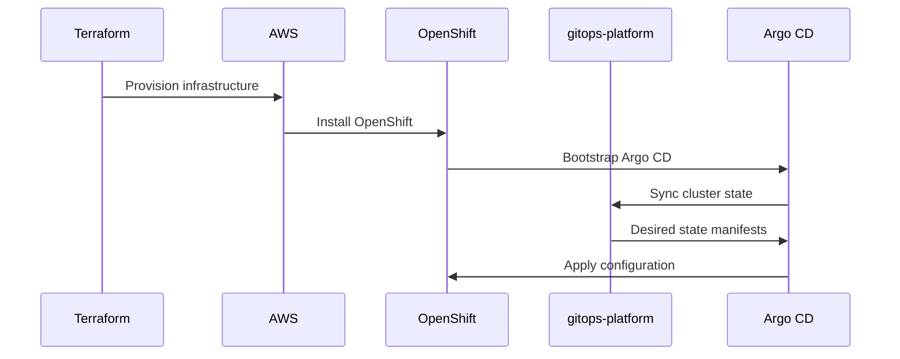

# OpenShift

Exarep runs on Red Hat OpenShift, the enterprise Kubernetes platform. This page covers the cluster configuration and node topology.

## Cluster Naming Convention

Clusters follow the naming pattern:

```
{cluster_name}.{env}.{cluster_type}.{openshift_type}.{base_domain}
```

| Field          | Values                                                |
| -------------- | ----------------------------------------------------- |
| cluster_name   | Optional identifier (dev1, lob2, etc.)                |
| env            | preprod, dev, test, prod                              |
| cluster_type   | hub, spoke                                            |
| openshift_type | ocp (full), ove (VMs only), okd (community)          |

**Example:** `dev1.dev.spoke.ocp.exarep.com`

## Node Roles

| Role            | Purpose                                              |
| --------------- | ---------------------------------------------------- |
| control-plane   | Kubernetes API server, etcd, scheduler               |
| worker          | Application workloads                                |
| infrastructure  | Platform services (router, monitoring, logging)      |

!!! warning
    The `master` role label is deprecated. Always use `control-plane`.

## Cluster Bootstrap

Cluster bootstrapping follows a two-phase approach:

1. **Infrastructure provisioning** — Terraform provisions AWS resources (VPC, DNS, compute) via the `iac-aws` repository.
2. **Cluster configuration** — OpenShift GitOps reconciles the desired state from the `gitops-platform` repository.



## Operators

The following operators are installed and managed via GitOps:

| Operator                         | Namespace                          | Purpose                              |
| -------------------------------- | ---------------------------------- | ------------------------------------ |
| OpenShift GitOps                 | openshift-gitops                   | Argo CD for declarative management   |
| OpenShift Pipelines              | openshift-pipelines                | Tekton for CI/CD                     |
| Red Hat Service Mesh             | openshift-service-mesh             | Istio-based service mesh             |
| AMQ Streams                      | exarep-kafka                       | Kafka for event streaming            |
| External Secrets Operator        | external-secrets                   | Secrets from external stores         |
| Red Hat Advanced Cluster Security | stackrox                          | Container security                   |
| Red Hat Developer Hub            | developer-hub                      | Developer portal                     |
| Red Hat Connectivity Link        | connectivity-link                  | API gateway                          |
