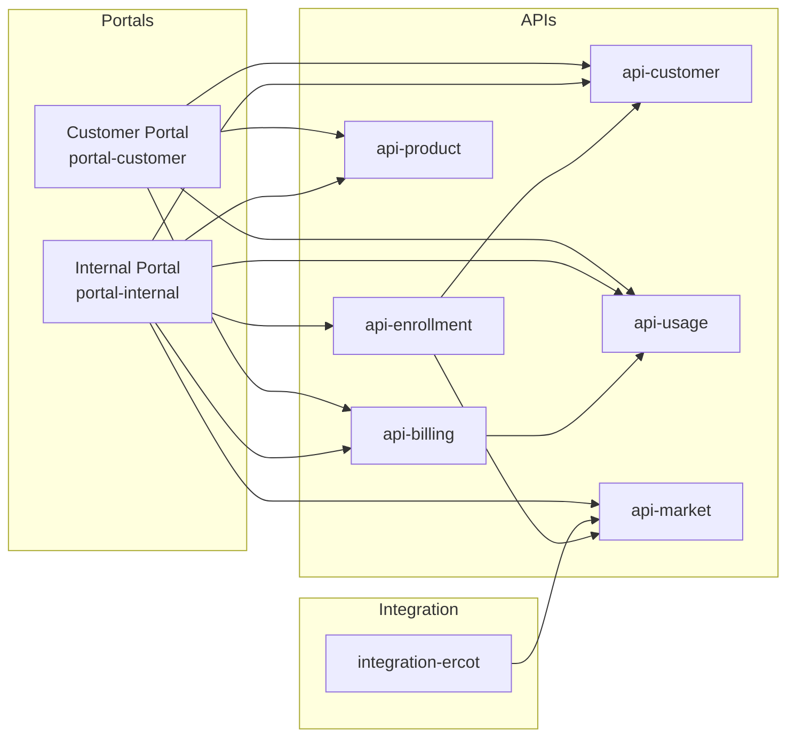

# Services Overview

This section documents the individual Exarep microservices, their APIs, configuration, and deployment details.

## Service Map



## Service Summary

| Service            | Port | Database          | Kafka Topics                        | Description                               |
| ------------------ | ---- | ----------------- | ----------------------------------- | ----------------------------------------- |
| api-customer       | 8080 | exarep_customer   | customer.created, account.created   | Customer and account management           |
| api-enrollment     | 8080 | exarep_enrollment | enrollment.submitted                | Enrollment and switch transactions        |
| api-billing        | 8080 | exarep_billing    | invoice.generated                   | Billing and invoicing                     |
| api-usage          | 8080 | exarep_usage      | usage.interval.received             | Meter usage data                          |
| api-market         | 8080 | exarep_market     | market.transaction.completed        | ERCOT market integration                  |
| api-product        | 8080 | exarep_product    | product.created, product.updated    | Product and rate plan management          |
| portal-customer    | 4200 | ---               | ---                                 | Customer self-service UI                  |
| portal-internal    | 4200 | ---               | ---                                 | Internal operations UI                    |
| integration-ercot  | ---  | ---               | market.usage.received               | ERCOT market file batch processing        |

## Common Configuration

All API services share common Quarkus configuration patterns:

```yaml
quarkus:
  banner:
    enabled: false
  http:
    port: 8080
  oidc:
    auth-server-url: ${OIDC_AUTH_SERVER_URL}
    client-id: ${OIDC_CLIENT_ID}
  datasource:
    db-kind: postgresql
    jdbc:
      url: ${DATASOURCE_JDBC_URL}
    username: ${DATASOURCE_USERNAME}
    password: ${DATASOURCE_PASSWORD}
  flyway:
    migrate-at-start: true
  kafka:
    bootstrap-servers: ${KAFKA_BOOTSTRAP_SERVERS}
```

## API Versioning

All REST APIs use URL-based versioning:

```
/api/v1/{resource}
```

Each service publishes an OpenAPI specification accessible at `/q/openapi` in development.

## Authentication and Authorization

Services authenticate requests using OIDC JWT tokens. Keycloak is the reference OIDC provider, but the configuration is provider-agnostic.

Authorization is enforced at the method level using `@RolesAllowed` annotations with roles defined in a `Roles` interface within each service.
